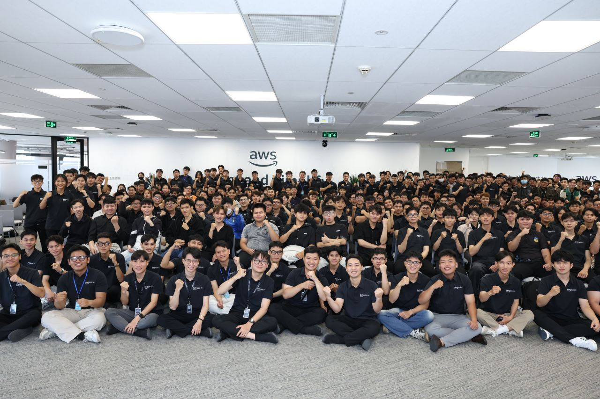

# Event Report: "FCAJ Community Day"

### Event Objectives

- Share effective self-learning methods based on how the brain works.
- Provide career orientation and engineering mindset for students pursuing IT and Cloud Computing.
- Introduce how AI can be applied to the software development process to improve productivity.

### Speakers

- **Huynh Hoang Long** - Admin of FCAJ
- **Thinh Nguyen** - DevOps/Cloud Engineer, First Cloud AI Journey
- **Khang Nguyen** - Solution Architect, Cloud Kinetics Vietnam
- **Thao Nguyen** - Gen AI Engineer, VIB

## Key Highlights

### Building Effective Learning Habits

The first session focused on maintaining learning motivation by leveraging the brain's **dopamine** mechanism.

- Explained why people are more attracted to social media than studying due to **instant gratification**.
- Suggested breaking learning goals into smaller tasks to create a continuous sense of achievement.
- Recommended using a **learning streak** to build consistent study habits and maintain motivation.
- Introduced the **2-Minute Rule**, encouraging immediate action on tasks that take less than two minutes.
- Emphasized creating a clean and organized study environment to improve concentration.

### Career Orientation and Engineering Mindset

The speaker shared practical insights for students and beginners pursuing careers in IT and Cloud Computing.

- Focus on building a strong **foundation** instead of chasing the latest technologies.
- Understand that AI is a productivity tool rather than a replacement for critical thinking and problem-solving.
- Value **integrity**, continuous learning, and the willingness to learn from mistakes.
- Evaluate a job based on multiple factors instead of salary alone, including:
  - Experience
  - Network
  - Education and Skills
  - Growth Potential

### Applying AI to the Software Development Process

The final session introduced the **Builder AI Mindset (BMM)** approach.

- Build a development workflow from planning and documentation to task breakdown and progress management.
- Breaking complex tasks into smaller parts helps AI better understand the context, reduces **hallucinations**, and improves response quality.
- Standardize teamwork by managing task statuses such as **Draft**, **Approve**, and **Block**.

## What I Learned

### Learning Strategies

- Understood how dopamine influences learning motivation.
- Learned to maintain motivation by breaking large goals into manageable tasks.
- Recognized the importance of building consistent study habits.
- Realized that a well-organized learning environment improves productivity.

### Career Development

- Strong fundamental knowledge is more valuable than simply following technology trends.
- AI is most effective when users understand the underlying concepts.
- Integrity and problem-solving skills are essential qualities of a software engineer.
- Career decisions should consider experience, networking opportunities, learning potential, and future growth.

### Working with AI

- Learned how to structure requests so AI can provide better assistance.
- Understood an AI-assisted workflow from planning to execution.
- Recognized the importance of documentation and task management during software development.

## Practical Applications

- Apply task breakdown techniques to build a more effective AWS and Cloud learning plan.
- Maintain a daily learning routine by creating continuous study streaks.
- Use AI to assist with planning, documentation, and task management while validating its output.
- Continue strengthening fundamental knowledge of operating systems, networking, databases, and cloud computing.
- Develop problem-solving skills and professional ethics during both study and teamwork.

## Event Experience

Participating in **FCAJ Community Day** provided valuable insights into effective learning methods, career development, and AI-assisted software development.

### Learning Better Study Methods

- Gained a deeper understanding of how dopamine affects learning motivation.
- Learned how to make studying more engaging by setting small milestones and rewarding progress.
- Realized the importance of building sustainable learning habits.

### Career Insights

- Developed a clearer understanding of the skills required for a career in IT and Cloud Computing.
- Learned that strong fundamentals and problem-solving skills are more important than simply learning new technologies.
- Understood the importance of integrity and lifelong learning in a professional environment.

### Working with AI

- Learned how AI can assist with planning, documentation, and project management.
- Understood the benefits of breaking tasks into smaller pieces for both AI collaboration and teamwork.

### Key Takeaways

- Learning motivation can be sustained through consistent habits and small rewards.
- Strong foundational knowledge is essential for adapting to rapidly changing technologies.
- AI is a powerful assistant but cannot replace human reasoning, analysis, and responsibility.
- Well-structured planning, documentation, and workflow management improve both individual and team productivity.

### Event Photos



*Figure 1. Photo taken during the FCAJ Community Day event.*

> Overall, FCAJ Community Day helped me learn effective study methods while providing practical insights into career development, the engineering mindset, and the application of AI in software development. These valuable lessons can be applied directly to both my studies and future career.
```
