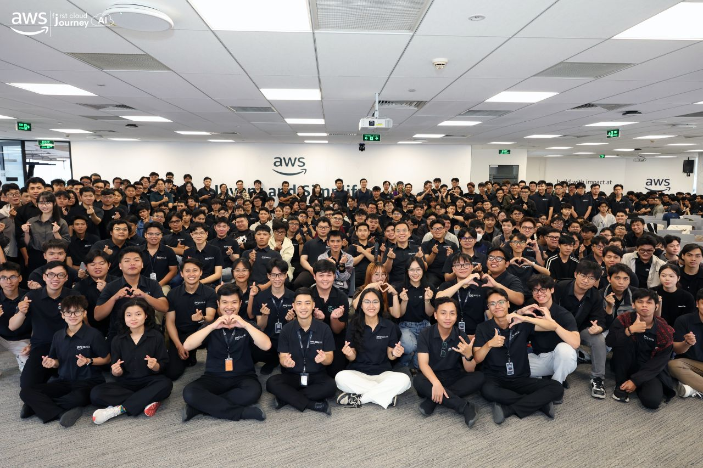

# Bài thu hoạch “FCAJ Community Day”

### Mục Đích Của Sự Kiện

- Chia sẻ kinh nghiệm ứng dụng AI trong học tập, phát triển phần mềm và môi trường doanh nghiệp.
- Cập nhật các xu hướng mới về Generative AI, DevOps và Cloud Computing.
- Giới thiệu các giải pháp AI Agent, Amazon Q và kiến trúc Multi-Agent trong thực tế.
- Tạo cơ hội giao lưu, học hỏi từ các chuyên gia đang làm việc trong lĩnh vực AI và Cloud.

### Danh Sách Diễn Giả

- **Truong Tinh** - Platform Engineer GoTymeX
- **Anh Pham** - Cloud Consultant G-Asia Pacific Vietnam
- **Nguyen Tuan Thinh** - DevOps/Cloud Engineer
- **Thao Nguyen** - Gen AI Engineer VIB
- **Mai Nguyen** - Gen AI Engineer VIB
- **Uyen Le** - Gen AI Engineer VIB
- **Dao Duc** - Solutions Architect Cloud Kinetics
- **Vy Lam** - Senior Business Systems Analyst VPBank

## Nội Dung Nổi Bật

### Ngữ cảnh là chìa khóa để khai thác AI hiệu quả

Buổi chia sẻ nhấn mạnh vai trò của **Context** khi làm việc với AI, giúp AI hiểu đúng bài toán thay vì chỉ dựa vào Prompt.

- Giới thiệu vai trò của **Platform Engineer** trong việc xây dựng nền tảng Self-service cho lập trình viên.
- Context cần bao gồm mục tiêu, đối tượng sử dụng, quy chuẩn coding, tài liệu dự án và kiến thức nội bộ.
- Không nên bổ sung những kiến thức phổ biến mà AI đã biết, thay vào đó cần cung cấp thông tin đặc thù của doanh nghiệp.
- Tránh sao chép Prompt hoặc mã nguồn từ Internet mà không hiểu ngữ cảnh.
- Xây dựng **AI Mindset**, xem AI là công cụ hỗ trợ tư duy và nâng cao hiệu suất làm việc.

### Trợ lý AI cho doanh nghiệp với Amazon Q

Diễn giả giới thiệu **Amazon Q** như một trợ lý AI dành cho doanh nghiệp với khả năng kết nối và tự động hóa nhiều quy trình.

- Kết nối với Microsoft Teams, Microsoft Office, Gmail, Google Calendar, Jira, Confluence và các dịch vụ AWS.
- Xây dựng AI Agent thực hiện các tác vụ như tóm tắt cuộc họp, phân tích dữ liệu Excel, tạo dashboard và gửi email tự động.
- Hỗ trợ Business Intelligence, Chat với dữ liệu doanh nghiệp và Automation Flow.
- Tuân thủ AWS Shared Responsibility Model trong quá trình triển khai.
- Demo các tình huống thực tế như tạo dashboard từ Excel, sinh System Prompt và tự động hóa công việc sau cuộc họp.

### Kỹ thuật Prompting, DevOps và tối ưu hệ thống với Amazon CloudFront

Buổi chia sẻ cung cấp kinh nghiệm sử dụng AI hiệu quả kết hợp với các giải pháp tối ưu trên AWS.

- Xây dựng Prompt theo cấu trúc rõ ràng với Goal, Context và Format.
- Giới thiệu cơ chế Flat-rate Pricing của Amazon CloudFront giúp doanh nghiệp dự báo chi phí dễ dàng hơn.
- Chia sẻ giải pháp chống DDoS và kỹ thuật SYN Proxy.
- Tận dụng CloudFront Functions để xử lý logic tại Edge nhằm giảm độ trễ và cải thiện hiệu năng.

### Hành trình xây dựng UTMorpho từ ý tưởng đến sản phẩm

Nhóm diễn giả chia sẻ hành trình tham gia cuộc thi **LotusHack** trong 36 giờ liên tục.

- Xây dựng công cụ hỗ trợ sinh và chỉnh sửa giao diện bằng AI từ nhu cầu thực tế.
- Thiết kế AI Agent sinh giao diện HTML/CSS và cho phép chỉnh sửa trực tiếp.
- Chia sẻ kinh nghiệm làm việc dưới áp lực thời gian, giới hạn token và cắt giảm tính năng.
- Bài học quan trọng là ưu tiên giá trị cốt lõi, phân chia công việc hợp lý và quản lý thời gian hiệu quả.

### Tính không xác định của các thiết lập "Deterministic" trong mô hình ngôn ngữ lớn (LLM)

Diễn giả giải thích nguyên nhân khiến các mô hình LLM vẫn có thể tạo ra kết quả khác nhau dù cấu hình **Temperature = 0**.

- Giới thiệu nguyên lý hoạt động của LLM và tham số Temperature.
- Phân tích ảnh hưởng của sai số tính toán trên GPU và xử lý song song.
- Trình bày tác động của các kỹ thuật tối ưu Inference trên nền tảng Cloud.
- So sánh kết quả giữa mô hình Cloud và mô hình Self-host.
- Đề xuất các giải pháp như Structured Output, JSON Mode, chạy nhiều lần và thiết kế hệ thống có khả năng xử lý nhiều dạng đầu ra.

### Xây dựng hệ thống Multi-Agent đạt tiêu chuẩn doanh nghiệp

Buổi chia sẻ giới thiệu cách xây dựng hệ thống Multi-Agent phục vụ bài toán đánh giá tín dụng cho Startup.

- Mỗi AI Agent đảm nhiệm một nhiệm vụ như phân tích tài chính, nghiên cứu thị trường, đánh giá đội ngũ sáng lập và phân tích rủi ro.
- Nhấn mạnh việc thiết kế hệ thống cần xuất phát từ bài toán nghiệp vụ.
- Chú trọng bảo mật, Compliance, Prompt Injection, Audit Trail và Human-in-the-loop.
- Khuyến khích kỹ sư AI phát triển thêm kiến thức về phần mềm, hạ tầng, bảo mật và đánh giá ROI.

## Những Gì Học Được

### Tư Duy Làm Việc Với AI

- Hiểu được tầm quan trọng của Context khi sử dụng AI.
- Biết cách xây dựng Prompt có cấu trúc để nâng cao chất lượng phản hồi.
- Nhận thức rằng AI chỉ hỗ trợ tăng năng suất, không thay thế tư duy của con người.

### Kiến Thức Cloud và DevOps

- Hiểu cách Amazon Q hỗ trợ doanh nghiệp xây dựng AI Agent và tự động hóa quy trình.
- Nắm được cơ chế định giá mới của Amazon CloudFront cùng các giải pháp tối ưu hiệu năng và bảo mật.
- Hiểu vai trò của CloudFront Functions trong việc giảm độ trễ cho ứng dụng.

### Xây Dựng Hệ Thống AI

- Hiểu nguyên nhân dẫn đến tính không xác định của các mô hình LLM.
- Biết cách thiết kế hệ thống AI có khả năng xử lý nhiều dạng đầu ra.
- Hiểu mô hình Multi-Agent và các yêu cầu về bảo mật, tuân thủ khi triển khai AI trong doanh nghiệp.

## Ứng Dụng Vào Công Việc

- Áp dụng phương pháp xây dựng Context khi làm việc với AI trong học tập và phát triển phần mềm.
- Sử dụng AI để hỗ trợ lập tài liệu, xây dựng Prompt và tự động hóa các công việc lặp lại.
- Tìm hiểu và thực hành các dịch vụ Amazon Q, CloudFront và AI Agent trên AWS.
- Áp dụng tư duy Multi-Agent khi nghiên cứu các hệ thống AI phức tạp.
- Rèn luyện kỹ năng phân tích bài toán nghiệp vụ trước khi lựa chọn giải pháp công nghệ.

## Trải Nghiệm Trong Sự Kiện

Tham gia **FCAJ Community Day** giúp tôi có cơ hội tiếp cận nhiều kiến thức thực tế về AI, Cloud Computing và DevOps từ các chuyên gia đang làm việc trong doanh nghiệp.

### Học hỏi từ các diễn giả

- Hiểu rõ hơn cách ứng dụng AI trong môi trường doanh nghiệp.
- Tiếp cận kinh nghiệm xây dựng Prompt, AI Agent và Multi-Agent System.
- Học được tư duy triển khai AI gắn với bài toán thực tế thay vì chỉ tập trung vào công nghệ.

### Tiếp cận các công nghệ mới

- Tìm hiểu khả năng tự động hóa của Amazon Q.
- Hiểu thêm về Amazon CloudFront trong tối ưu hiệu năng, chi phí và bảo mật.
- Nắm được nguyên nhân khiến LLM có thể tạo ra các kết quả khác nhau dù sử dụng cùng một cấu hình.

### Bài học rút ra

- AI phát huy hiệu quả khi được cung cấp đúng Context và dữ liệu phù hợp.
- Khi triển khai AI trong doanh nghiệp cần quan tâm đến bảo mật, khả năng mở rộng và tính tuân thủ.
- Các cuộc thi Hackathon là cơ hội tốt để rèn luyện kỹ năng giải quyết vấn đề, làm việc nhóm và quản lý thời gian.

### Một số hình ảnh khi tham gia sự kiện



*Hình 2. Hình ảnh tại sự kiện FCAJ Community Day.*

> Sau khi tham gia **FCAJ Community Day**, tôi nhận ra AI không chỉ hỗ trợ viết code mà còn có thể đồng hành trong quá trình học tập và làm việc nếu được sử dụng đúng cách. Tôi đặc biệt ấn tượng với tư duy xây dựng **Context** khi làm việc với AI và cách doanh nghiệp ứng dụng **AI Agent** để giải quyết các bài toán thực tế. Buổi hội thảo cũng giúp tôi hiểu rõ hơn tầm quan trọng của tư duy giải quyết vấn đề, kỹ năng làm việc nhóm và tạo thêm động lực để tiếp tục học tập, tìm hiểu sâu hơn về AI và Cloud.
```
