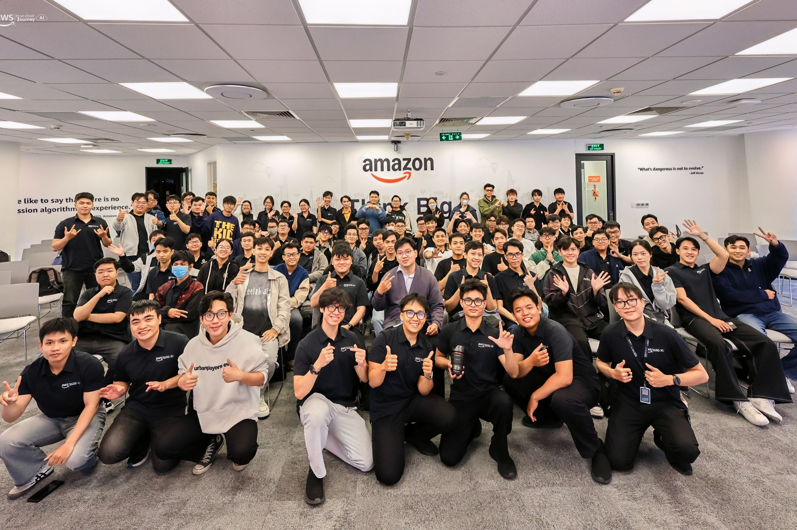

# Bài thu hoạch “FCAJ Community Day - June 2026”

### Mục Đích Của Sự Kiện

- Cập nhật xu hướng ứng dụng AI và Cloud Computing trong doanh nghiệp.
- Chia sẻ kinh nghiệm phát triển sự nghiệp, khởi nghiệp và xây dựng sản phẩm AI thực tế.
- Giới thiệu các giải pháp AI Agent, Voice AI và DevOps Agent trên nền tảng AWS.
- Giúp sinh viên tiếp cận những mô hình triển khai AI hiện đại và các yêu cầu khi đưa AI vào môi trường production.

### Danh Sách Diễn Giả

- **Steve Tran** - Founder CloudThinker
- **Hieu Nghi** 
- **Trung Vu** - CEO Revve AI
- **Kiet** - AWS Student Video Group
- **Bao Phan** - Cloud Engineer Cloud Kinetics
- **Nguyen Nguyen** - Cloud Engineer Cloud Kinetics
- **Truong Tran** - AI Solution Sales Noventiq
- **Anh Dang** - Solution Sales Noventiq
- **Toan Nguyen** - AWS Security Builder

## Nội Dung Nổi Bật

### Chia sẻ về lộ trình nghề nghiệp và khởi nghiệp

Diễn giả chia sẻ hành trình phát triển từ kỹ sư vận hành hệ thống lên vị trí Solution Architect tại AWS, đồng thời giới thiệu quá trình xây dựng startup CloudThinker.

- Chia sẻ kinh nghiệm học tập, lấy chứng chỉ AWS và nắm bắt xu hướng chuyển đổi lên Cloud.
- AI đang thay đổi thị trường lao động, doanh nghiệp sẽ ưu tiên những kỹ sư có chuyên môn tốt và biết khai thác AI hiệu quả.
- Khuyến khích sinh viên tham gia thực tập sớm để tích lũy kinh nghiệm thực tế và nâng cao năng lực cạnh tranh.
- Giới thiệu nền tảng CloudThinker với các chức năng như Incident Management, FinOps, Security Assessment và tự động đánh giá hạ tầng bằng AI.
- Chia sẻ lý do lựa chọn kiến trúc **Multi-Agent System** nhằm phân chia nhiệm vụ, tối ưu Context, giảm chi phí và tăng khả năng quản lý quyền truy cập.
- Nhấn mạnh bài học khởi nghiệp: bắt đầu từ bài toán thực tế, nhanh chóng triển khai ý tưởng và phát triển sản phẩm dựa trên nhu cầu khách hàng.

### Xây dựng Voice Agent có khả năng mở rộng

Buổi chia sẻ tập trung vào cách xây dựng hệ thống Voice AI trên nền tảng AWS và các thách thức khi triển khai tiếng Việt.

- Giới thiệu hai kiến trúc phổ biến gồm **Speech-to-Speech** và **Speech-to-Text → LLM → Text-to-Speech**.
- Phân tích lý do doanh nghiệp tại Việt Nam ưu tiên kiến trúc Speech-to-Text kết hợp LLM để đạt hiệu quả xử lý tốt hơn.
- Demo xây dựng Voice Agent bằng **AWS Bedrock AgentCore** kết hợp **Knowledge Base** để trả lời các câu hỏi về sản phẩm.
- Chia sẻ các yêu cầu kỹ thuật khi triển khai Voice Agent như streaming thời gian thực, nhận diện giới tính, xử lý ngắt lời, Tool Calling và quản lý Prompt.
- Nhấn mạnh Voice Agent cần phối hợp với con người và có khả năng chuyển cuộc hội thoại cho nhân viên khi AI không xử lý được yêu cầu.

### DevOps Agent – Trợ lý AI hỗ trợ vận hành hệ thống

Diễn giả giới thiệu **AWS DevOps Agent**, giải pháp AI hỗ trợ đội ngũ DevOps trong quá trình giám sát và xử lý sự cố.

- Agent học kiến trúc hệ thống thông qua Topology, Context, Memory và Skills.
- Tích hợp với các dịch vụ AWS để thu thập log, metrics và traces phục vụ quá trình điều tra.
- Quy trình hoạt động gồm phát hiện sự cố, phân tích nguyên nhân, đề xuất phương án khắc phục và cải thiện hệ thống.
- Demo khả năng điều tra một cuộc tấn công DDoS và xây dựng kế hoạch xử lý trong thời gian ngắn.
- Khẳng định DevOps Agent giúp giảm MTTR và MTTD nhưng vẫn cần kỹ sư DevOps phê duyệt trước khi thực hiện.

### Ứng dụng AI trong quản lý nhân sự doanh nghiệp

Buổi chia sẻ giới thiệu cách sử dụng **Amazon Q** để tối ưu quy trình tuyển dụng và quản lý nhân sự.

- Tự động sàng lọc hồ sơ, đối chiếu với JD và phân tích mức độ phù hợp của ứng viên.
- Hỗ trợ tạo báo cáo và xây dựng quy trình tuyển dụng dựa trên dữ liệu.
- Kết nối với nhiều nguồn dữ liệu để tự động hóa các công việc lặp lại.
- Giúp bộ phận nhân sự tiết kiệm thời gian và nâng cao hiệu quả tuyển dụng.

### Xây dựng Private MCP bảo mật cho Amazon Q

Diễn giả trình bày giải pháp xây dựng **Private MCP Server** giúp Amazon Q truy cập dữ liệu nội bộ một cách an toàn.

- Giới thiệu kiến trúc sử dụng Amazon VPC, Private DNS, ALB và VPC Connection.
- Đảm bảo dữ liệu nội bộ không phải truyền qua Internet công cộng.
- Demo kết nối Amazon Q với MCP Server để truy xuất dữ liệu doanh nghiệp.
- Chia sẻ chi phí triển khai và những lưu ý khi áp dụng trong môi trường thực tế.

## Những Gì Học Được

### Định hướng nghề nghiệp

- Hiểu rõ hơn về lộ trình phát triển trong lĩnh vực Cloud và AI.
- Nhận thức được tầm quan trọng của kinh nghiệm thực tế, chứng chỉ và khả năng ứng dụng AI trong công việc.
- Học được tư duy khởi nghiệp dựa trên nhu cầu thực tế của khách hàng.

### Kiến thức về AI và Cloud

- Hiểu cách xây dựng Voice Agent và các yêu cầu khi triển khai trong doanh nghiệp.
- Biết cách AI Agent hỗ trợ DevOps trong quá trình giám sát và xử lý sự cố.
- Hiểu vai trò của Multi-Agent System trong việc giải quyết các bài toán phức tạp.
- Nắm được mô hình triển khai Private MCP để bảo vệ dữ liệu doanh nghiệp.

### Ứng dụng AI trong doanh nghiệp

- Hiểu cách Amazon Q hỗ trợ tuyển dụng và tự động hóa quy trình làm việc.
- Nhận thức được vai trò của AI trong việc nâng cao năng suất thay vì thay thế hoàn toàn con người.
- Hiểu rằng các hệ thống AI khi đưa vào production cần đảm bảo tính bảo mật, khả năng kiểm soát và có sự giám sát của con người.

## Ứng Dụng Vào Công Việc

- Tiếp tục học tập và thực hành các dịch vụ AWS liên quan đến AI và Cloud.
- Áp dụng AI để hỗ trợ phân tích tài liệu, tự động hóa công việc và nâng cao hiệu suất học tập.
- Tìm hiểu sâu hơn về kiến trúc Multi-Agent, Voice Agent và Amazon Q.
- Rèn luyện kỹ năng giải quyết bài toán thực tế thay vì chỉ tập trung vào công nghệ.
- Chuẩn bị kiến thức nền tảng và kinh nghiệm thực tế để đáp ứng nhu cầu tuyển dụng trong lĩnh vực Cloud và AI.

## Trải Nghiệm Trong Sự Kiện

Tham gia **FCAJ Community Day - June 2026** giúp tôi hiểu rõ hơn cách các doanh nghiệp đang ứng dụng AI vào nhiều lĩnh vực khác nhau như vận hành hạ tầng, chăm sóc khách hàng, tuyển dụng và bảo mật. Tôi đặc biệt ấn tượng với chia sẻ về hành trình khởi nghiệp của CloudThinker và cách các diễn giả xây dựng những hệ thống AI phục vụ các bài toán thực tế thay vì chỉ tập trung vào mô hình. Bên cạnh đó, các phiên demo về Voice Agent, DevOps Agent và Private MCP cũng giúp tôi hình dung rõ hơn quy trình triển khai AI trong môi trường production. Buổi hội thảo mang đến cho tôi nhiều kiến thức thực tiễn và tạo thêm động lực để tiếp tục học tập, nghiên cứu về AI, Cloud Computing và các dịch vụ AWS.

### Một số hình ảnh khi tham gia sự kiện



*Hình 3. Hình ảnh tại sự kiện FCAJ Community Day.*

> Sau buổi hội thảo, tôi hiểu rõ hơn cách AI được ứng dụng trong doanh nghiệp để giải quyết các bài toán thực tế như vận hành hệ thống, tuyển dụng và chăm sóc khách hàng. Những chia sẻ của các diễn giả cũng giúp tôi có định hướng rõ hơn trong việc học AI, Cloud Computing và các dịch vụ AWS để chuẩn bị cho công việc trong tương lai.
```
